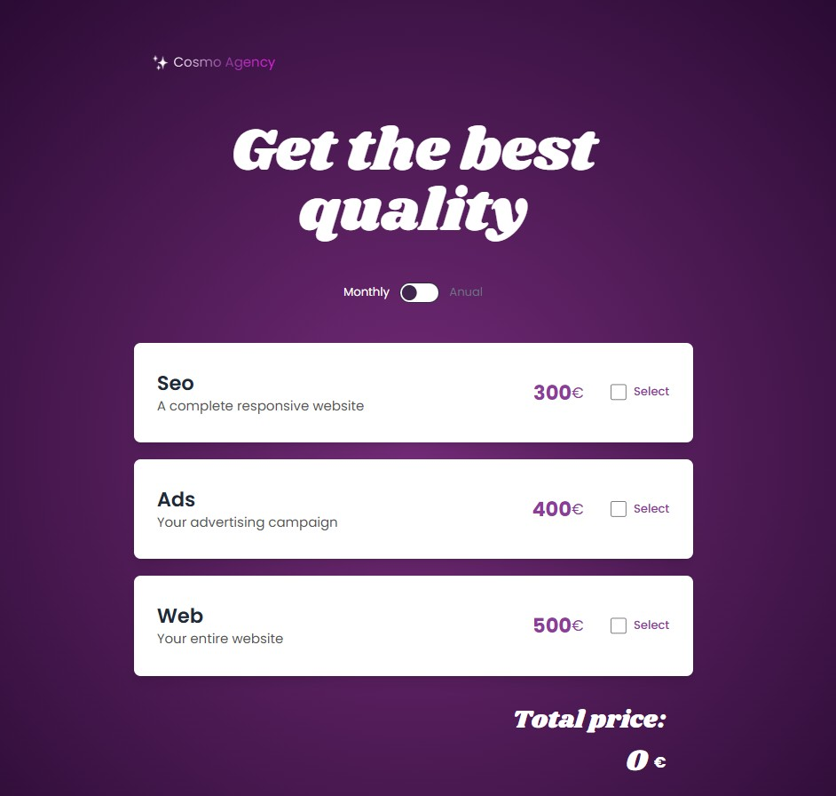

# React pricing and budget cards

## 📄 Description

Welcome! This is my budget estimation tool, built with React and Vite, and featuring a services selection, real-time price calculation, and client information management. The app includes URL parameters for sharing the budgets and different pages, built with React Router. It also has filters, and a clean, responsive design. Hope you like it.



## 💻 Technologies Used

- React
- Vite
- Typescript
- Tailwind CSS
- Daisy UI
- React Router

## 💡 Functionalities

- [x] Reusable components
- [x] Pages
- [x] Service selection with options
- [x] Anual discount toggle
- [x] URL parameters
- [x] Client info form
- [x] Requested estimation/Budget
- [x] Routes and pages
- [ ] Unit testing
- [ ] User authentication
- [ ] Database integration

## 📋 Requirements

- Node.js and npm installed on your system. You can download them from [nodejs.org](https://nodejs.org/).

## 🚀 Installation

**✔️ Step 1:** Clone the repository to your local machine (using your username):

```bash
git clone https://github.com/your-username/react-budget-cards.git
cd react-budget-cards
```

**✔️ Step 2:** Install the required dependencies:

```bash
npm install
```

**✔️ Step 3:**  Start the development server using Vite:

```bash
npm run dev
```
Once the server is running, you'll see a URL similar to:

```bash
 > Local: http://localhost:5173/
```

## 🤝 Contributions
If you want to contribute or report issues, feel free to create an issue or submit a pull request.
